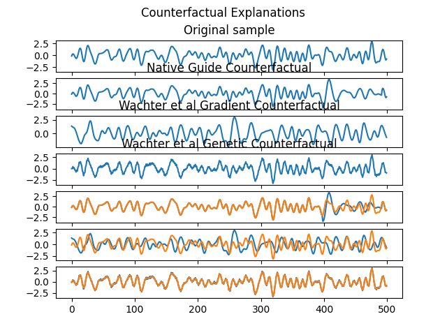

# Counterfactual Explanation Algorithms for Time Series Models

Basic implementations of various counterfactual algorithms for time series classification.  
Implementations are with Pytorch and Captum.

## Wachter et al.

The base implementations can be found at `cf_wachter`.  
Further information can be obtained here:  
https://christophm.github.io/interpretable-ml-book/counterfactual.html

```
Wachter, S., Mittelstadt, B., & Russell, C. (2017).
Counterfactual explanations without opening the black box: Automated decisions and the GDPR.
Harv. JL & Tech., 31, 841.
```

Some considerations:  
There are two variants of this approach (genetic and gradient).  
The genetic variant uses the sensitivity of the model towards changes on the input to identify the best change for the counterfactual.  
The optimization variant incorporates the gradient of the model to modify the input to generate the counterfactual.

A better fitting model on the training data needs more time (steps) to generate a counterfactual using the genetic variant.
If possible use the optimization variant.

## Native-Guide

The base implementations can be found at `cf_native_guide`.  
Further information can be obtained here:  
https://github.com/e-delaney/Instance-Based_CFE_TSC

```
Delaney, E., Greene, D., & Keane, M. T. (2021, September).
Instance-based counterfactual explanations for time series classification.
In International Conference on Case-Based Reasoning (pp. 32-47). Springer, Cham.
```

## Comte

https://github.com/peaclab/CoMTE

```
Ates, E., Aksar, B., Leung, V. J., & Coskun, A. K. (2021, May).
Counterfactual Explanations for Multivariate Time Series.
In 2021 International Conference on Applied Artificial Intelligence (ICAPAI) (pp. 1-8). IEEE.
```

## Testing

The implementations can be tested with the `test.py` script in the `utils` folder.  
It will use the UCR FordA dataset as a default for training.  
The model is a small scale convolution neural network with 1D convolutions.  
A random sample from the test data is used as base for the counterfactual explanations.

An example:  


## License

Released under MIT License. See the LICENSE file for details.

## Reference

```
@software{cf-ts-us-2022,
  author = {Schlegel, Udo},
  title = {Counterfactual Explanation Algorithms for Time Series Models},
  url = {https://github.com/visual-xai-for-time-series/counterfactual-explanations-for-time-series},
  version = {1.0.0},
  year = {2022}
}
```

