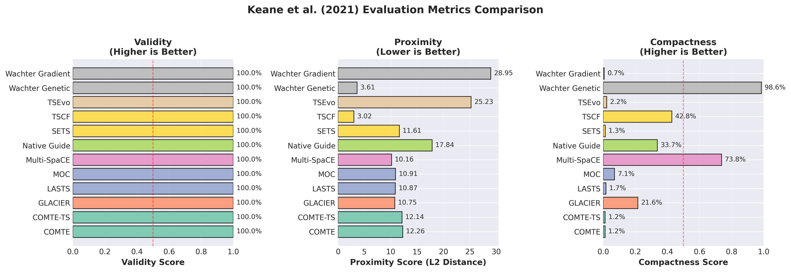

# Counterfactual Explanation Algorithms for Time Series Models

[](https://opensource.org/licenses/MIT)
[](https://www.python.org/downloads/)
[](https://pytorch.org/)
[](https://github.com/psf/black)

A comprehensive collection of counterfactual explanation algorithms for time series classification with PyTorch implementations. This library provides state-of-the-art methods for generating and evaluating counterfactual explanations, helping to understand and interpret deep learning models for time series data.

## Table of Contents

- [Quick Start](#quick-start)
- [Implemented Algorithms](#implemented-algorithms)
- [Comprehensive Evaluation Metrics](#comprehensive-evaluation-metrics)
- [Examples and Datasets](#examples-and-datasets)
- [Visualization Examples](#visualization-examples)
- [Installation](#installation)
- [Usage](#usage)
- [Key Features](#key-features)
- [Project Structure](#project-structure)
- [License](#license)
- [References and Citations](#references-and-citations)
- [Disclaimer](#disclaimer)
- [Acknowledgments](#acknowledgments)

## Quick Start

```bash
# Install dependencies
pip install -r requirements.txt

# Run all examples and evaluations
cd examples
python run_all.py

# Run individual examples
python example_univariate.py          # FordA dataset
python example_multivariate.py   # Multi-channel Arabic digits
python metrics_evaluation_example.py  # Comprehensive metrics
```

## Implemented Algorithms

This library implements **19+ state-of-the-art counterfactual explanation methods** for time series classification, organized into:

- **Optimization-Based Methods**: Wachter, COMTE, GLACIER, TSCF
- **Evolutionary Methods**: MOC/DANDL, TSEvo, Multi-SpaCE, Sub-SpaCE
- **Instance-Based Methods**: Native Guide, CELS
- **Latent Space Methods**: Latent CF, LASTS
- **Segment-Based Methods**: SETS, SG-CF, DisCOX
- **Hybrid Methods**: Time-CF, FastPACE, MG-CF, TimeX

📚 **For detailed descriptions, key features, academic references, and code examples for each method, see [REFERENCES.md](REFERENCES.md)**

## Comprehensive Evaluation Metrics

The library includes a complete suite of metrics for evaluating counterfactual quality across six key dimensions:

### **Validity Metrics** (`cfts/metrics/validity.py`)
- `prediction_change`: Verifies target class prediction is achieved
- `class_probability_confidence`: Measures prediction confidence
- `decision_boundary_distance`: Distance from decision boundary

### **Proximity Metrics** (`cfts/metrics/proximity.py`)
- `l2_distance`: Euclidean distance between time series
- `manhattan_distance`: L1 distance measure
- `dtw_distance`: Dynamic Time Warping distance
- `frechet_distance`: Temporal ordering-aware distance
- `normalized_distance`: Scale-invariant distance

### **Sparsity Metrics** (`cfts/metrics/sparsity.py`)
- `l0_norm`: Number of modified time points
- `percentage_changed_points`: Fraction of changes
- `segment_based_sparsity`: Continuous segment modifications
- `gini_sparsity_coefficient`: Distribution of change magnitudes

### **Realism Metrics** (`cfts/metrics/realism.py`)
- `domain_constraint_violations`: Domain-specific rule violations
- `statistical_similarity`: Distribution similarity to original data
- `temporal_consistency`: Temporal pattern preservation
- `autocorrelation_preservation`: Time dependency maintenance
- `spectral_similarity`: Frequency domain characteristics

### **Diversity Metrics** (`cfts/metrics/diversity.py`)
- `pairwise_distance`: Diversity between multiple counterfactuals
- `coverage_metric`: Feature space coverage
- `novelty_metric`: Uniqueness compared to training data
- `diversity_index`: Shannon diversity index

### **Stability Metrics** (`cfts/metrics/stability.py`)
- `algorithmic_stability`: Consistency across runs
- `input_stability`: Robustness to input perturbations
- `hyperparameter_sensitivity`: Parameter stability analysis

## Examples and Datasets

### Available Examples
- **`example_univariate.py`**: FordA automotive dataset (UCR Archive)
- **`example_multivariate.py`**: Multi-channel spoken Arabic digits
- **`metrics_evaluation_example.py`**: Comprehensive metrics demonstration

### Supported Datasets
- **UCR Time Series Archive**: Automatic download and preprocessing
- **Synthetic Data**: Built-in generators for controlled experiments
- **Custom Datasets**: Easy integration with custom time series data

### Pre-trained Models
- `simple_cnn_2.pth`: Binary classification (FordA)
- `cnn_multi_arabicdigits_10ch.pth`: Multi-class, multi-channel

## Visualization Examples

The library generates publication-ready visualizations:


*Individual counterfactuals and overlay comparisons for FordA dataset*


*Multi-channel counterfactual analysis for Arabic digits*


*Evaluation using Keane et al. (2021) metrics: Validity, Proximity, and Compactness across all algorithms*

## Installation

### Requirements
- Python 3.9+
- PyTorch 2.0+
- NumPy, SciPy, Matplotlib
- Scikit-learn
- Captum (for attribution methods)
- Optional: dtaidistance (for DTW distance metric)

### Setup
```bash
# Clone the repository
git clone https://github.com/visual-xai-for-time-series/counterfactual-explanations-for-time-series.git
cd counterfactual-explanations-for-time-series

# Install dependencies
pip install -r requirements.txt
```

## Usage

### Basic Usage
```python
import numpy as np
from cfts.cf_wachter import wachter_genetic_cf
from cfts.cf_native_guide import native_guide_uni_cf
from cfts.metrics import l2_distance, prediction_change

# Generate counterfactual
cf, prediction = wachter_genetic_cf(sample, model, step_size=0.1)

# Evaluate quality
proximity = l2_distance(sample, cf)
validity = prediction_change(model, sample, cf, target_class=1)
```

### Advanced Example
```python
from cfts.metrics import CounterfactualEvaluator, benchmark_algorithms

# Comprehensive evaluation
evaluator = CounterfactualEvaluator()
results = benchmark_algorithms(
    algorithms=['wachter', 'native_guide', 'comte', 'sets'],
    samples=test_samples,
    model=trained_model,
    dataset=dataset
)
```

### Running All Examples
```bash
# Execute complete pipeline
python examples/run_all.py
```

## Key Features

- **Research-Ready**: Implementations of state-of-the-art algorithms
- **Comprehensive Metrics**: Six categories of evaluation measures
- **Rich Visualizations**: Publication-quality plots and comparisons
- **Easy Integration**: Simple API for custom models and datasets
- **Efficient**: Optimized implementations with GPU support
- **Well-Documented**: Extensive examples and documentation
- **Reproducible**: Seed control and deterministic results
- **Robust**: Error handling and input validation

## Project Structure

```
counterfactual-explanations-for-time-series/
├── cfts/                          # Main library
│   ├── cf_ab_cf/                 # AB-CF implementation
│   ├── cf_cels/                  # CELS implementation
│   ├── cf_cfwot/                 # CFWoT implementation
│   ├── cf_cgm/                   # CGM implementation
│   ├── cf_comte/                 # COMTE implementation
│   ├── cf_counts/                # CoUNTS implementation
│   ├── cf_dandl/                 # MOC implementation
│   ├── cf_discox/                # DisCOX implementation
│   ├── cf_fastpace/              # FastPACE implementation
│   ├── cf_fft_cf/                # FFT-CF implementation
│   ├── cf_glacier/               # GLACIER implementation
│   ├── cf_lasts/                 # LASTS implementation
│   ├── cf_latent_cf/             # Latent CF implementation
│   ├── cf_mg_cf/                 # MG-CF implementation
│   ├── cf_multispace/            # Multi-SpaCE implementation
│   ├── cf_native_guide/          # Native Guide implementation
│   ├── cf_sets/                  # SETS implementation
│   ├── cf_sg_cf/                 # SG-CF implementation
│   ├── cf_sparce/                # SpArCE implementation
│   ├── cf_subspace/              # Sub-SpaCE implementation
│   ├── cf_terce/                 # TERCE implementation
│   ├── cf_time_cf/               # Time-CF implementation
│   ├── cf_tscf/                  # TSCF implementation
│   ├── cf_tsevo/                 # TSEvo implementation
│   ├── cf_wachter/               # Wachter et al. implementation
│   └── metrics/                  # Evaluation metrics
│       ├── validity.py           # Validity metrics
│       ├── proximity.py          # Proximity metrics
│       ├── sparsity.py           # Sparsity metrics
│       ├── realism.py            # Realism metrics
│       ├── diversity.py          # Diversity metrics
│       └── stability.py          # Stability metrics
├── examples/                      # Usage examples
│   ├── example_univariate.py     # FordA dataset example
│   ├── example_multivariate.py   # Arabic digits example
│   ├── metrics_evaluation_example.py  # Metrics demo
│   └── run_all.py               # Execute all examples
├── models/                       # Pre-trained models
└── requirements.txt              # Dependencies
```

## License

Released under MIT License. See the LICENSE file for details.

## References and Citations

### Core Library Citation
```bibtex
@software{cfts-us-2025,
  author = {Schlegel, Udo},
  title = {Counterfactual Explanation Algorithms for Time Series Models},
  url = {https://github.com/visual-xai-for-time-series/counterfactual-explanations-for-time-series},
  year = {2025}
}
```

### Related Work and Surveys

- **Guidotti, R. (2022)**. "Counterfactual explanations and how to find them: literature review and benchmarking." *Data Mining and Knowledge Discovery*, 1-55.

- **Verma, S., et al. (2020)**. "Counterfactual explanations for machine learning: A review." *arXiv preprint arXiv:2010.10596*.

- **Molnar, C. (2020)**. "Interpretable machine learning: A guide for making black box models explainable." *christophm.github.io/interpretable-ml-book/*

---

## Disclaimer

**AI-Assisted Development**: Please note that portions of this codebase have been generated or enhanced with the assistance of AI coding tools. While we have thoroughly tested and validated all implementations, users are encouraged to review the code and verify its correctness for their specific use cases.

---

## Acknowledgments

This library builds upon numerous research contributions in explainable AI and counterfactual explanations. We thank all researchers and developers who have contributed to this field, particularly the authors of the implemented algorithms.

**Special thanks to:**
- The UCR Time Series Classification Archive for providing standard datasets
- The PyTorch and scikit-learn communities for excellent tools
- All contributors and users who help improve this library
